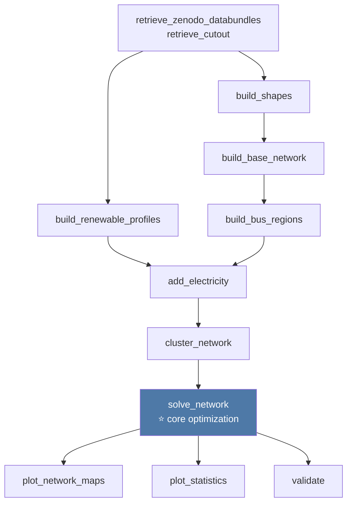
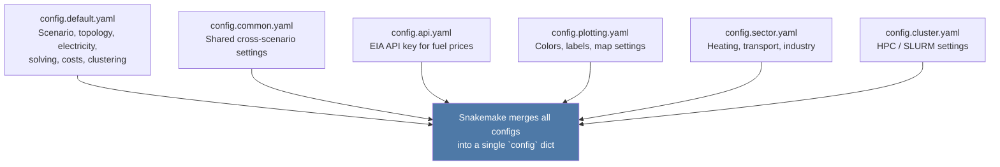

# Introduction to PyPSA-USA

This guide is for people who are new to this codebase, Snakemake, or power sector modeling. It covers what the model does, how the code is organized, and how to run it. For deeper theory, links to PyPSA's own documentation are provided throughout.

---

## What does this model do?

PyPSA-USA is an open-source model of the US electricity system. Given assumptions about technology costs, demand, policy constraints, and available resources, it finds the least-cost combination of power plants and transmission investments that can reliably serve electricity demand — and simulates how those plants would actually dispatch over time.

The model covers the three main US interconnections (Western, Eastern, ERCOT/Texas) and can represent the power system at varying levels of geographic resolution, from individual states down to transmission planning zones. It can also model sector coupling — representing how electrification of heating, transportation, and industry interacts with the power grid.

If you are new to power sector modeling concepts (buses, generators, linear optimal power flow), the [PyPSA documentation](https://pypsa.readthedocs.io/en/latest/introduction.html) is the best starting point.

---

## How the workflow is organized

The model is built as a [Snakemake](https://snakemake.readthedocs.io/en/stable/) workflow. Snakemake is a build system for data pipelines: you define rules that describe how to produce output files from input files, and Snakemake figures out the order to run them, which steps can be skipped (outputs already exist), and which can run in parallel.

All workflow code lives in the `workflow/` directory. You run the model by calling `snakemake` from inside that directory.

### The five rule groups

The workflow is split across five rule files, each handling a distinct phase:

```mermaid
flowchart LR
    subgraph R[" 1 · retrieve.smk "]
        direction TB
        r1[Download weather cutouts]
        r2[Download grid data]
        r3[Download demand data]
    end
    subgraph B[" 2 · build_electricity.smk "]
        direction TB
        b1[Build network topology]
        b2[Add generators & costs]
        b3[Cluster to target resolution]
    end
    subgraph S[" 3 · solve_electricity.smk "]
        direction TB
        s1[Run linear\noptimization]
    end
    subgraph P[" 4 · postprocess.smk "]
        direction TB
        p1[Generate maps]
        p2[Compute statistics]
    end
    subgraph V[" 5 · validate.smk "]
        direction TB
        v1[Back-cast against\nhistorical data]
    end
    R --> B --> S --> P --> V
```



### A simplified rule dependency graph

Each box below is a Snakemake rule — a script that produces specific output files. Arrows show which outputs feed into which rules.



---

## The configuration system

The model's behavior is controlled by a set of YAML config files in `workflow/config/`. Snakemake merges all of them at startup; later files override keys from earlier ones.



> ⚠️ **`config.default.yaml` is commented out in `workflow/Snakefile` line 92 by default.**
> Uncomment it before running the workflow. See `guides/CODEBASE-NOTES.md` for details.

### Key config sections in `config.default.yaml`

| Section | What it controls |
|---------|-----------------|
| `run` | Run name, shared resources/cutouts |
| `scenario` | Interconnect, number of clusters, options |
| `model_topology` | Transmission network source, spatial resolution |
| `snapshots` | Simulation time period |
| `electricity` | Generator types, renewable carriers, load settings |
| `costs` | Year, discount rate, CO2 price |
| `clustering` | How nodes are aggregated |
| `solving` | Solver settings, relaxation options |
| `enable` | Feature flags (e.g. `build_cutout`) |

---

## Directory structure

```
pypsa-usa/
├── workflow/
│   ├── Snakefile              # Entry point — loads config, includes rule files
│   ├── rules/                 # One .smk file per workflow phase
│   │   ├── retrieve.smk
│   │   ├── build_electricity.smk
│   │   ├── build_sector.smk
│   │   ├── solve_electricity.smk
│   │   ├── postprocess.smk
│   │   └── validate.smk
│   ├── scripts/               # Python scripts called by each rule
│   ├── config/                # Your local config files (gitignored — run init script)
│   ├── repo_data/             # Static input data committed to the repo
│   │   ├── costs/             # Technology cost assumptions
│   │   ├── geospatial/        # Shapefiles for US regions, BAs, NERC zones
│   │   └── ReEDS_Constraints/ # Policy and transmission constraints
│   └── envs/                  # Conda environment spec (alternative to UV)
├── guides/
│   ├── INTRO.md               # This file
│   ├── DEV-CONTAINER-GUIDE.md # Dev container setup and usage
│   ├── CODEBASE-NOTES.md      # Non-obvious behaviors and debugging gotchas
│   └── intro_tour.ipynb       # Interactive tour of the codebase (start here)
└── docs/                      # ReadTheDocs source
```

---

## Running the model

### 1. First-time setup

```bash
# Copy config templates into workflow/config/
bash init_pypsa_usa.sh

# Uncomment config.default.yaml in workflow/Snakefile line 92
```

### 2. Dry run (recommended first step)

A dry run shows every rule Snakemake would execute without actually running anything. Use this to verify your config is valid and understand the execution plan.

```bash
cd workflow
snakemake --dry-run
```

### 3. Full run (local, 4 cores)

```bash
cd workflow
snakemake --cores 4
```

### 4. Visualize the DAG

```bash
cd workflow
snakemake --dag | dot -Tsvg > dag.svg
```

---

## What does the optimization actually solve?

At its core, the `solve_network` rule passes a PyPSA network object to a linear solver (HiGHS by default). The solver finds:

- **Which generators to build** (capacity expansion) — and at what capacity
- **How to dispatch those generators** hour-by-hour — subject to operational constraints

The objective is to minimize total system cost (capital + operating) over the simulation period, subject to:
- Demand must be met in every hour at every location
- Transmission line capacity limits
- Generator ramp rates and capacity factors
- Any policy constraints (RPS, CO2 caps, etc.)

For the mathematical formulation, see the [PyPSA optimization model docs](https://pypsa.readthedocs.io/en/latest/optimal_power_flow.html).

---

## Next steps

- **Interactive tour:** Open `guides/intro_tour.ipynb` in VS Code or JupyterLab for a hands-on walkthrough of the config, cost data, and geospatial inputs.
- **Configuration guide:** See `docs/source/config-configuration.md` for a full reference of every config key.
- **Gotchas:** See `guides/CODEBASE-NOTES.md` for non-obvious behaviors that trip up new users.
